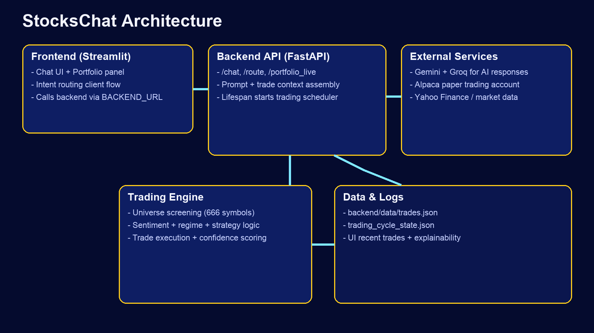
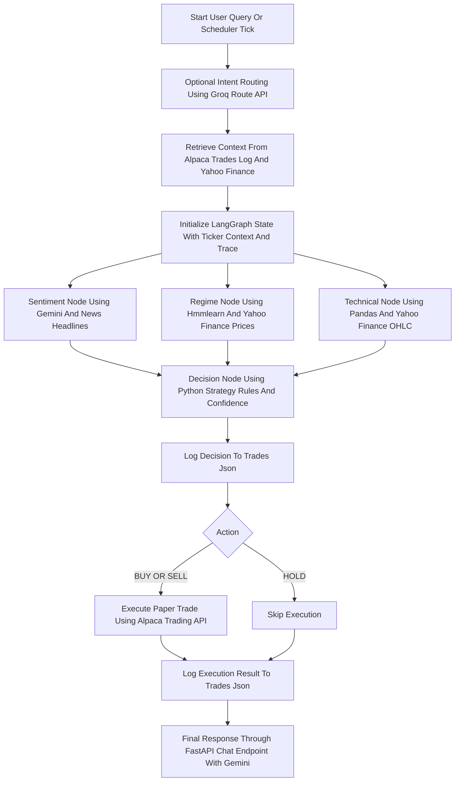
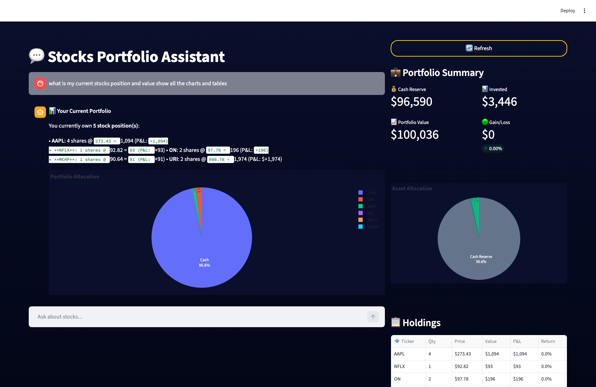
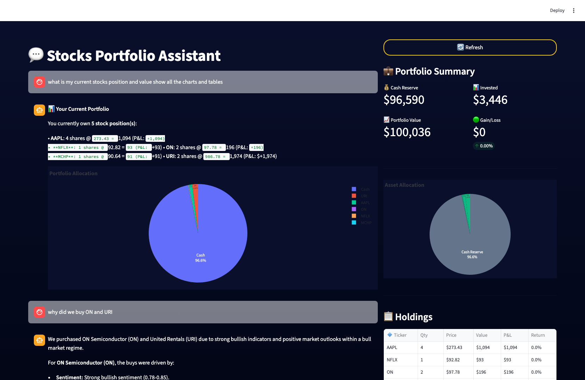
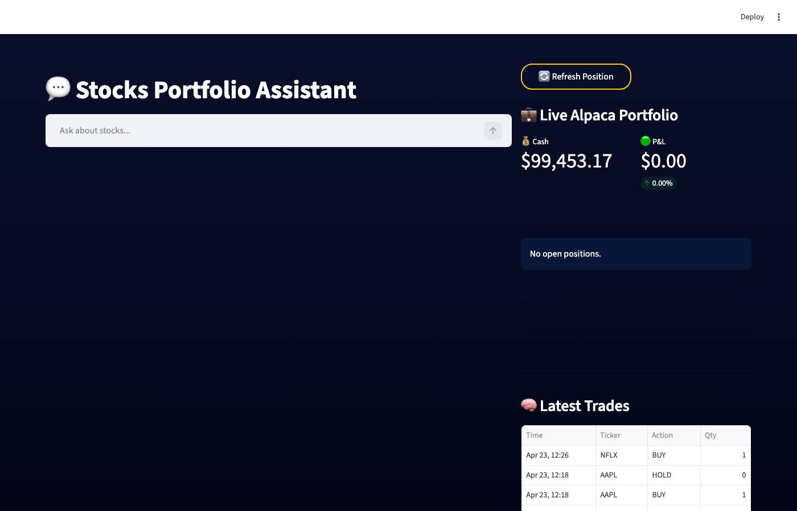

# StocksChat


StocksChat is an AI trading copilot with a Streamlit frontend and FastAPI backend. It explains paper trades using logged signals (sentiment, regime, confidence), answers portfolio questions in plain English, and runs an automated trade cycle over a broad stock universe.

StocksChat uses a practical retrieval-augmented generation (RAG) pattern and LangGraph orchestration:

- RAG: portfolio state, recent trade logs, and market-news snippets are retrieved at query time and injected into prompts so responses are grounded in current account context.
- LangGraph: the stock-analysis/trading pipeline is modeled as a graph-based workflow that passes state across analysis steps before generating a trade decision.

## Features

- AI chat for analysis, portfolio, correlation, and trade-decision questions
- Explainable trade context from recent logs (action, reason, confidence)
- Retrieval-augmented responses grounded in live portfolio, recent trades, and market news
- LangGraph-powered stateful analysis workflow for stock decisioning
- Live Alpaca paper portfolio panel
- Automated screening and paper-trade execution flow
- Cloud-ready deployment (Railway)

## Project Structure

- frontend/app.py: Streamlit app
- backend/main.py: FastAPI app and chat endpoints
- backend/trading/: trading strategy, scheduler, broker client, logging
- start_backend.sh: backend start command for deployment
- start_frontend.sh: frontend start command for deployment

## Architecture



### LangGraph Flow Chart



### LangGraph Workflow

1. Retrieve live context: portfolio (Alpaca API), trade history (trades.json), and news/prices (Yahoo Finance API).
2. Build the LangGraph state and run analysis nodes in parallel: sentiment (Gemini API), regime (hmmlearn), and technicals (pandas).
3. Merge node outputs into one decision payload (action, confidence, reason).
4. Log the decision first, then execute BUY/SELL through Alpaca API (or HOLD), and log execution outcome.
5. Return user-facing explanation through FastAPI endpoints, with Gemini used for natural-language reasoning.

### How RAG Is Used

StocksChat applies RAG at runtime by retrieving current domain context before generation:

- Portfolio retrieval: live cash, positions, value, and P&L are fetched from Alpaca.
- Trade-log retrieval: recent trade decisions, confidence, sentiment, regime, and explanation are loaded.
- News retrieval: latest ticker-specific news headlines are pulled and summarized.

This retrieved context is embedded into the chat/system prompt so model outputs are grounded in your latest account/trading state rather than generic market text.

## Screenshots

### Home Dashboard


### Query: Current Stocks Position and Value (Charts + Tables)

Query: what is my current stocks position and value show all the charts and tables



### Query: Why Did We Buy ON and URI?

Query: why did we buy ON and URI



### Additional Query/Response View


## Demo GIF

Quick chat flow demo (home -> portfolio query -> ON/URI reasoning):



## Local Setup

### 1) Clone and install

```bash
git clone https://github.com/sidmadan40/StocksChat.git
cd StocksChat
python3 -m venv venv
source venv/bin/activate
pip install -r requirements.txt
```

### 2) Configure environment

```bash
cp .env.example .env
```

Fill .env with your own API keys.

### 3) Run backend

```bash
source venv/bin/activate
uvicorn backend.main:app --host 127.0.0.1 --port 8000 --reload
```

### 4) Run frontend

```bash
source venv/bin/activate
streamlit run frontend/app.py --server.address 127.0.0.1 --server.port 8501
```

Open http://127.0.0.1:8501

## Deploy on Railway

Use two Railway services from the same repo:

- Backend service start command: `sh start_backend.sh`
- Frontend service start command: `sh start_frontend.sh`
- Frontend env var: `BACKEND_URL=https://<your-backend-service>.up.railway.app`

Set these backend env vars in Railway:

- GEMINI_API_KEY
- GROQ_API_KEY (optional, only needed for the `/route` classifier endpoint)
- APCA_API_KEY_ID
- APCA_API_SECRET_KEY
- APCA_API_BASE_URL

## Security Notes

- .env is intentionally gitignored
- Never commit API keys or private credentials
- Use Alpaca paper-trading keys for testing

## License

For personal/educational use unless you add a license file.
