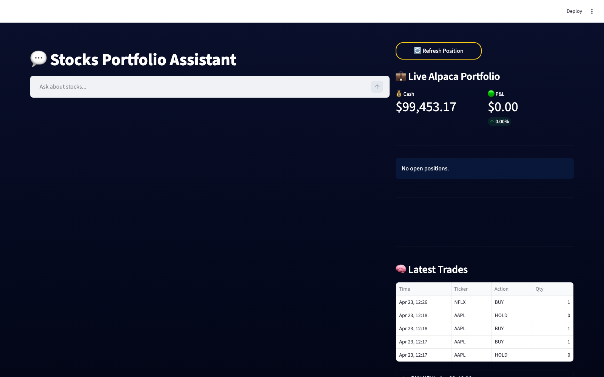
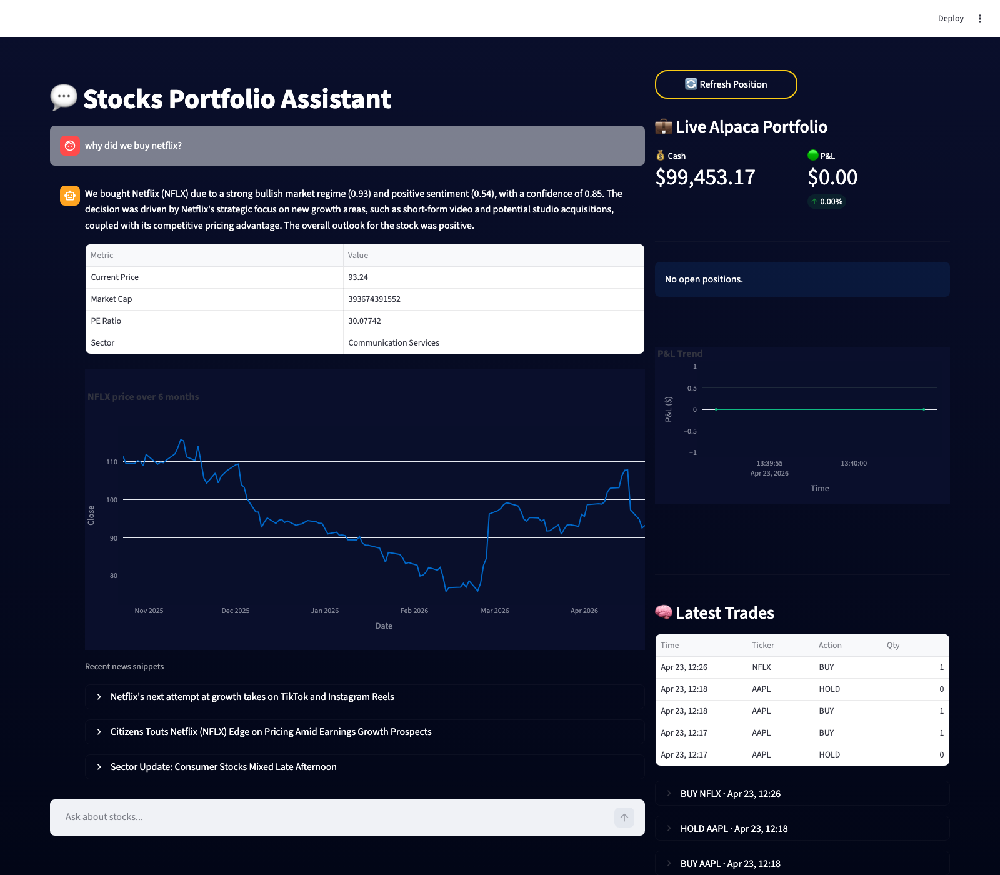

# StocksChat

StocksChat is an AI trading copilot with a Streamlit frontend and FastAPI backend. It explains paper trades using logged signals (sentiment, regime, confidence), answers portfolio questions in plain English, and runs an automated trade cycle over a broad stock universe.

## Features

- AI chat for analysis, portfolio, correlation, and trade-decision questions
- Explainable trade context from recent logs (action, reason, confidence)
- Live Alpaca paper portfolio panel
- Automated screening and paper-trade execution flow
- Cloud-ready deployment (Railway)

## Project Structure

- frontend/app.py: Streamlit app
- backend/main.py: FastAPI app and chat endpoints
- backend/trading/: trading strategy, scheduler, broker client, logging
- start_backend.sh: backend start command for deployment
- start_frontend.sh: frontend start command for deployment

## Screenshots

### Home Dashboard



### Query and Response (Real Example)

Query: Why did we buy Netflix?



## Local Setup

### 1) Clone and install

```bash
git clone https://github.com/sidmadan40/StocksChat.git
cd StocksChat
python3 -m venv venv
source venv/bin/activate
pip install -r requirements.txt
```

### 2) Configure environment

```bash
cp .env.example .env
```

Fill .env with your own API keys.

### 3) Run backend

```bash
source venv/bin/activate
uvicorn backend.main:app --host 127.0.0.1 --port 8000 --reload
```

### 4) Run frontend

```bash
source venv/bin/activate
streamlit run frontend/app.py --server.address 127.0.0.1 --server.port 8501
```

Open http://127.0.0.1:8501

## Deploy on Railway

Use two Railway services from the same repo:

- Backend service start command: `sh start_backend.sh`
- Frontend service start command: `sh start_frontend.sh`
- Frontend env var: `BACKEND_URL=https://<your-backend-service>.up.railway.app`

Set these backend env vars in Railway:

- GEMINI_API_KEY
- GROQ_API_KEY
- APCA_API_KEY_ID
- APCA_API_SECRET_KEY
- APCA_API_BASE_URL

## Security Notes

- .env is intentionally gitignored
- Never commit API keys or private credentials
- Use Alpaca paper-trading keys for testing

## License

For personal/educational use unless you add a license file.
